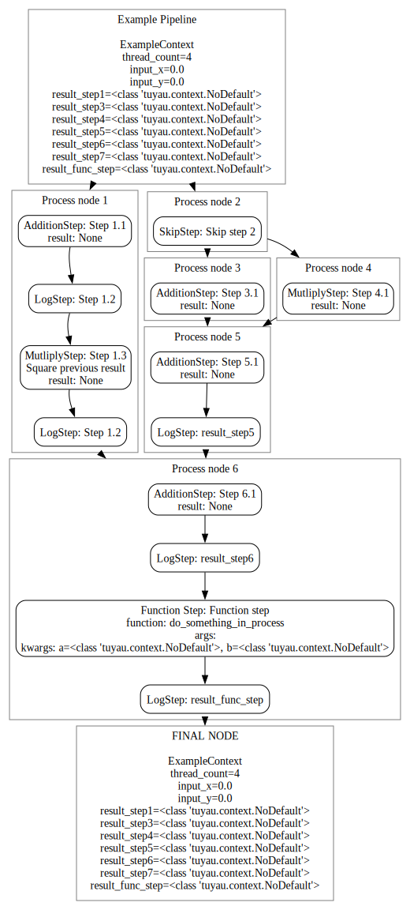
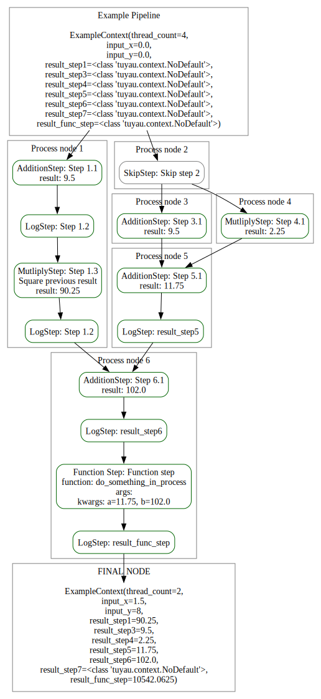

# Tuyaux - an easy and safe pipeline library 🚀

> In French, tuyaux means pipes

This repository is under active developpment. Breaking changes may occur on a regular basis. Feel free to share ideas and suggestions. This repository will be updated to add discussions and the todolist I am working on.

## Table of content
- [Table of content](#table-of-content)
- [Introduction](#introduction)
- [Examples](#examples)
  - [1. Create your Steps and Nodes 🧑‍💻](#1-create-your-steps-and-nodes-)
  - [2. Connect everything together and validate input/outputs 🔗](#2-connect-everything-together-and-validate-inputoutputs-)
  - [3. Preview 🕵️](#3-preview-️)
  - [4. Execute and check the result! 🎉🎉🎉](#4-execute-and-check-the-result-)


## Introduction

A python library to build, validate and run simple, parallelized *and blazingly fast* pipelines using a DAG (Directed Acyclic Graph)!

This library makes extensive use of type hinting and requires python 3.11 or newer. I highly recommand enabling your type-checker in your IDE and to use Pyright/Pylance (not tested with mypy) to have the most enjoyable experience. 


This library is pure python but requires [GraphViz](https://pypi.org/project/graphviz/) to be installed (python library and executable). The goal is to split graphviz functions in their optional submodules. This would allow you to use this lib with vanilla python and/or to implement your own graph viewer. 

## Examples

### 1. Create your Steps and Nodes 🧑‍💻

The complete example code can be found [here](./examples/example.py) and the classes are [here](./examples/example_utils.py).

```python
def square(a: float) -> float:
    return a**2


def do_something_in_process(a: float, b: float) -> float:
    pool = Pool(2)
    result = pool.map(square, (a, b))
    return sum(result)


def main():
    context = ExampleContext(input_x=PipeVar(1.5), input_y=PipeVar(8), thread_count=2)

    SquareStep = FuncStep.new(do_something_in_process)

    square_step = SquareStep(
        result_vars=context.result_func_step.as_output(),
        a=context.result_step5.as_input().T,
        b=context.result_step6.as_input().T,
    )

    node1 = PipeNode("Process node 1").add_steps(
        AdditionStep(
            a_field=context.input_x.as_input(),
            b_field=context.input_y.as_input(),
            res_field=context.result_step1.as_output(),
            name="Step 1.1",
        ),
        LogStep(context.result_step1, name="Step 1.2"),
        MutliplyStep(
            a_field=context.result_step1.as_input(),
            b_field=context.result_step1.as_input(),
            res_field=context.result_step1.as_output(),
            name="Step 1.3",
            comment="Square previous result",
        ),
        LogStep(context.result_step1, name="Step 1.2"),
    )

    node2 = PipeNode("Process node 2").add_steps(SkipStep("Skip step 2"))

    node3 = PipeNode(name="Process node 3").add_steps(
        AdditionStep(
            a_field=context.input_x.as_input(),
            b_field=context.input_y.as_input(),
            res_field=context.result_step3.as_output(),
            name="Step 3.1",
        )
    )

    node4 = PipeNode("Process node 4").add_steps(
        MutliplyStep(
            a_field=context.input_x.as_input(),
            b_field=context.input_x.as_input(),
            res_field=context.result_step4.as_output(),
            name="Step 4.1",
        )
    )

    node5 = PipeNode("Process node 5").add_steps(
        AdditionStep(
            a_field=context.result_step3.as_input(),
            b_field=context.result_step4.as_input(),
            res_field=context.result_step5.as_output(),
            name="Step 5.1",
        ),
        LogStep(context.result_step5, name="result_step5"),
    )

    node6 = PipeNode("Process node 6").add_steps(
        AdditionStep(
            a_field=context.result_step1.as_input(),
            b_field=context.result_step5.as_input(),
            res_field=context.result_step6.as_output(),
            name="Step 6.1",
        ),
        LogStep(context.result_step6, name="result_step6"),
        square_step,
        LogStep(context.result_func_step, name="result_func_step"),
    )

    directory = os.path.abspath(os.path.join(os.path.dirname(__file__), "..", "data"))
```

### 2. Connect everything together and validate input/outputs 🔗

```python
    pipeline = Pipeline(ExampleContext, "Example Pipeline")

    # The build method construst some data structures in the pipeline, checks for cycles and can check for input/output usage errors (recommended).
    # It also automatically connects all the childless nodes to the final node 
    # You MUST use this method to ensure your have a functional pipeline
    pipeline.build(
        pipeline.root_node >> (node1 & node2),
        (
            node2 >> (node3 & node4)
            # Some basic non-sense conditions
            // (
                lambda: node2.status is StatusEnum.COMPLETE,
                lambda: node2.status is not StatusEnum.ERROR,
            )
        ),
        (node3 & node4) >> node5,
        (node1 & node5) >> node6,
    )

    # another option is to use the following syntax if you do not like calling the root_node
    pipeline.start_nodes(node1, node2).build(
        node2 >> (node3 & node4), 
        ...
        )
```

### 3. Preview 🕵️

```python
    graph = pipeline.graph(preview=True)
    graph.render("example_preview", directory=directory, format="svg")
    graph.render("example_preview", directory=directory, format="png")
```



### 4. Execute and check the result! 🎉🎉🎉

```python
    pipeline.execute(context)
    graph = pipeline.graph()
    graph.render("example", directory=directory, format="svg")
    graph.render("example", directory=directory, format="png")
```


